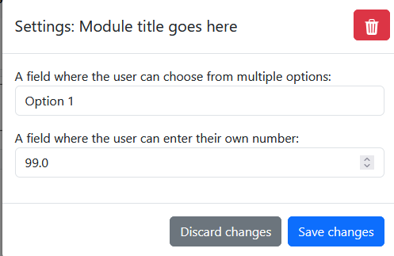
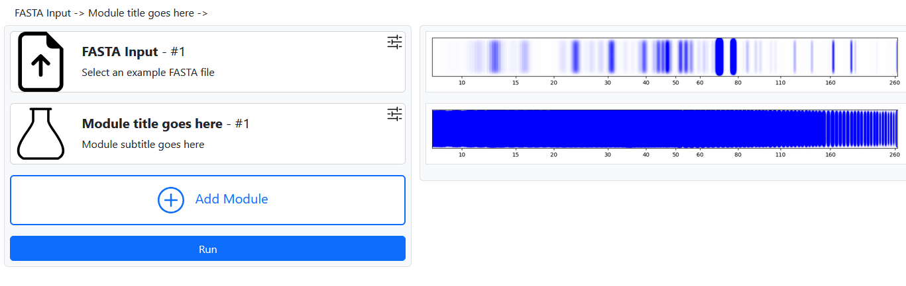
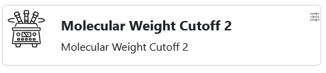
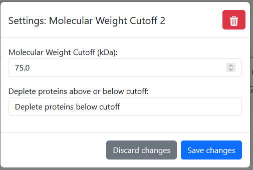

# How to implement a module 
> Looking for the practical tutorial? It can be found [here](#practical-example---molecular-weight-cutoff)

In EWOKS modules can be created by making changes to three files. For your convenience these files can all be found within the `_EACH` directory. 

These three files can be found in the following locations:

```
_EACH/
    modules/ 
        example.json
        fasta_input.json
        ...
        ... 
    modules.py
    protein.py
```

**File descriptions:**
- **modules/** - Contains JSON files that describe how each module should be rendered by the visual interface
- **modules.py** - Contains the Python code that is executed by each module
- **protein.py** - Contains the Protein class that simulates each protein within code

## Step 1: Implement the module in JSON for the rendering engine.

Let's take a look at how a module is implemented in JSON.
>Documentation on the EWOKS JSON Syntax and specific options can be found in: [MODULE_TEMPLATE.md](modules/_MODULE_TEMPLATE.md)

**JSON structure explanation:**
- The top-level key is the unique module identifier (cannot contain spaces)
- `id` must match the top-level key
- `title` - Display name shown in the UI
- `subtitle` - Brief description of what the module does
- `icon` - Path to icon file (relative to `app/EWOKS_Interface/static` directory)
- `settings` - Object containing all module configuration fields

```json
{
"unique_module_identifier": { 
"id": "unique_module_identifier", 
"title": "Module title goes here",
"subtitle": "Module subtitle goes here",
"icon": "icons/modules/placeholder.svg", 
"settings": {
        }
    }
}
```

Which will result in the following being rendered by the visual interface.


```json
"settings": {
    "A field where the user can choose from multiple options": {
        "formtype": "ChoiceField",
        "options": {"Option 1": ["Internal_code_for_option_1"],
                    "Option 2": ["Internal_code_for_option_2"],
                    "Option 3":["Internal_code_for_option_3"]
                    }
                },
    
    "A field where the user can enter their own number": {
        "formtype": "DecimalField",
        "default": 99.0,
        "min": 0.0,
        "max": 100.0,
        "step": 0.1}
}
```



The module shown above is visible within [example.json](modules/example.json) 

Try and change some values and refresh the EWOKS webpage to see how your changes affect the rendering.

---
## Common issues

### Changes not showing after refresh?

If you modified a `modules.json` file but don't see the changes when you refresh the website, your browser is likely caching the old version.

#### Solution: Disable Browser Cache

**Google Chrome:**
1. Open Developer Tools (`F12` or `Ctrl+Shift+I`)
2. Click the **Network** tab
3. Check the box labeled **"Disable cache"**
4. Keep Developer Tools open while testing
5. Refresh the page (`Ctrl+R` or `F5`)

**Firefox:**
1. Open Developer Tools (`F12` or `Ctrl+Shift+I`)
2. Click the **Network** tab
3. In the left sidebar, expand **"Disable cache"**
4. Refresh the page (`Ctrl+R` or `F5`)

**Safari:**
1. Enable the Develop menu: **Safari** → **Preferences** → **Advanced** → Check "Show Develop menu"
2. Click **Develop** → **Disable Caches**
3. Refresh the page (`Cmd+R`)

**Edge:**
1. Open Developer Tools (`F12`)
2. Click the **Network** tab
3. Check **"Disable cache"**
4. Refresh the page (`Ctrl+R` or `F5`)

**Alternative: Hard Refresh**
A quick way to bypass cache without opening Developer Tools:
- **Windows/Linux:** `Ctrl+Shift+R`
- **Mac:** `Cmd+Shift+R`

Your changes should now be visible!

## Error Messages

If you encounter issues:

1. **"Module key does not match module id field"**
   - Fix: The JSON object key must equal the module's `id` property
   - Example: `{"my_module": {"id": "my_module", ...}}`

2. **"Form field type was not found"**
   - Fix: Check your `formtype` spelling (case-sensitive)
   - Valid types: `ChoiceField`, `MultipleChoiceField`, `DecimalField`, `FileField`, `BooleanField`, `CharField`

3. **"Module is missing 'id' field"**
   - Fix: Ensure every module object has an `id` property

4. **"Module is missing 'settings' field"**
   - Fix: Ensure every module has a `settings` object (even if empty)

5. **Invalid JSON syntax**
   - Fix: Use a JSON validator tool to check for syntax errors (missing commas, brackets, etc.)

---


## Step 2: Implement the module in modules.py

The next step is to implement the module in Python so that actual changes to the proteins can be simulated.

### Step 2.1: Understanding the select() function

Open the [modules.py](modules.py) script and locate the `select()` function. This function routes module execution to the appropriate handler.

```py
def select(moduleIdentifier,selectedSettings,moduleData):
    """
    Dispatch the requested module to its backend implementation and return the simulated SDS-PAGE image.

    Settings (see module JSON):
    - Varies per module; each module function documents its own settings.

    :param moduleIdentifier: String module id (e.g., "fasta_input") coming from the frontend JSON definition.
    :param selectedSettings: Dict of user-selected values for the active module.
    :param moduleData: Loaded JSON defining all modules and their settings (options, defaults, etc.).
    :return: SDS-PAGE plot generated from the proteins produced by the module.

    """
    match moduleIdentifier:
        case "fasta_input":
            proteins = fasta_input(moduleIdentifier,selectedSettings,moduleData)
            return virtualSDSPage_2DGaussian(proteins)
        ...
        ...
        ...
        case "example_module":
            # Example module currently performs no transformation.
            return virtualSDSPage_2DGaussian(Protein.getAllProteins())
        case _: # Raise an error if module is not found
            raise NotImplementedError(f"Module: {moduleIdentifier} is not implemented yet.")

```

The `select()` function is responsible for executing the right module based on its identifier.

**Function parameters:**
- `moduleIdentifier` - The unique ID of the module currently being executed
- `selectedSettings` - Dictionary containing the settings the user selected in the visual interface
- `moduleData` - Combined data from all JSON module files (required when extracting internal option values)

### Step 2.2: Add your module to select()

Add a new case for your module in the `select()` function. Be careful with indentation as Python requires it.

```py
match moduleIdentifier:
    case "fasta_input":
        proteins = fasta_input(moduleIdentifier,selectedSettings,moduleData)
        return virtualSDSPage_2DGaussian(proteins)
    ...
    ...
    ...
    # -- newly added module --
    case "unique_module_identifier":
        proteins = newModule(moduleIdentifier,selectedSettings,moduleData)
        return virtualSDSPage_2DGaussian(proteins)
    case "example_module":
        # Example module currently performs no transformation.
        return virtualSDSPage_2DGaussian(Protein.getAllProteins())
    case _: # Raise an error if module is not found
        raise NotImplementedError(f"Module: {moduleIdentifier} is not implemented yet.")

```

As you can see `case "unique_module_identifier":` will now call our own custom function. In this case this function is named `newModule(moduleIdentifier,selectedSettings,moduleData)` but it can of course be named anything you want. As long as it matches the name you give it when declaring it later. 

Your new case `"unique_module_identifier"` will call your custom function `newModule()`. You can name this function anything you want, as long as it matches when you declare it.

> **Note:** All cases return `virtualSDSPage_2DGaussian(proteins)` - this function visualizes the protein list as an SDS-PAGE gel image. The proteins are returned from your module function and passed to the visualization system.

### Step 2.3: Declare your module function

Lets declare the module function by adding a new function to the bottom `module.py`

```py
def newModule(moduleIdentifier,selectedSettings, moduleData):
    # Implement your module here
    return proteins
```

### Step 2.4: Extract user settings and implement logic

Now let's extract the settings the user selected and use them in our module logic. To make this easier, we have a helper function called `extractSetting()` from `utils/helperFunctions.py` that handles the extraction for you.

**Why use extractSetting()?**

Instead of manually looking up settings in the `moduleData` dictionary (which can be tedious and error-prone), `extractSetting()` does it all for you. It finds the setting, looks up the internal value, and converts it to the right type (string, float, list, etc.) based on your JSON field type.

**How to use it:**

```py
from utils.helperFunctions import extractSetting

# Simple one-line call to get any setting:
myValue = extractSetting(settingName, moduleIdentifier, selectedSettings, moduleData)
```

The function automatically handles the conversion:
- `ChoiceField` settings → converted to a string
- `MultipleChoiceField` settings → converted to a list
- `DecimalField` settings → converted to a float
- `BooleanField` settings → converted to a boolean
- And so on...

**Available settings in this example:**
- `A field where the user can choose from multiple options` - ChoiceField with options: `Option 1`, `Option 2`, `Option 3`
- `A field where the user can enter their own number` - DecimalField accepting numeric values

**Example implementation:**

```py 
from utils.helperFunctions import extractSetting

def newModule(moduleIdentifier, selectedSettings, moduleData):
    # Extract the choice the user made - extractSetting() gets the internal value for us
    choiceFieldChosenOption = extractSetting(
        "A field where the user can choose from multiple options",
        moduleIdentifier,
        selectedSettings,
        moduleData
    )
    
    # Extract the number the user entered - automatically converted to a float
    chosenNumber = extractSetting(
        "A field where the user can enter their own number",
        moduleIdentifier,
        selectedSettings,
        moduleData
    )
    
    # Get all proteins currently in the session
    proteins = Protein.getAllProteins()
    
    # Set each protein's abundance to the number the user chose
    for protein in proteins:
        protein.set_abundance(chosenNumber)
    
    # Return the modified proteins for visualization
    return proteins
```


## (Optional) Step 3: Modify protein.py for advanced modules

Some modules require modifications to the Protein class itself, not just the module function in `modules.py`. This is necessary when:
- You need to add new protein properties or attributes
- Your module requires new calculation methods
- You want to add static methods for batch protein operations

The Protein class can be found in [protein.py](protein.py). Comprehensive documentation for this file is available in [protein_reference.md](protein_reference.md).

**Common modifications:**
- Adding new physicochemical property calculations
- Implementing new static methods for protein manipulation
- Adding getter/setter methods for custom attributes
Congratulations! You have now implemented your first module. 
With a chosenNumber of 0.1 it should look something like this:



## (Optional) Step 3: Modify Protein.py for more advanced models. 

Some of the models cannot be recreated in `modules.py` only. And changes to the class which simulates individual proteins is required. 
The class that simulates the Proteins can be found in [protein.py](protein.py) the documentation for this file can be found in [protein_reference.md](protein_reference.md)

---
---
---

## Practical example - Molecular Weight Cutoff

Lets implement a module that actually does something useful. Here we will be implementing a copy of the molecular Weight Cutoff module. 
This module depletes all protein that are either above or below a specified molecular weight. 

### Step 1: Make a copy of moduleTemplate.json

Lets start by making a copy of [moduleTemplate.json](modules/moduleTemplate.json) this way we do not have to write everything from scratch. 
I'll name the file `molecularWeightCutoff_2.json` but you can choose any name you want. As long as it ends in `.json`

### Step 2: Delete unnecessary fields

By default [moduleTemplate.json](modules/moduleTemplate.json) contains all possible fields you can use. For this module we only need a `ChoiceField` and a `DecimalField`, so delete the rest.

- The `DecimalField` will allow the user to enter a weight value that will be used as the cutoff.
- The `ChoiceField` will allow the user to select whether we deplete proteins above or below the cutoff.

> See [_MODULE_TEMPLATE.md](modules/_MODULE_TEMPLATE.md) for documentation for all possible fields.

When you have deleted all non required fields from the json file you now should have something like this:

```json
{
"example_module": {
"id": "example_module",
"title": "Example Module",
"subtitle": "An example module for demonstration purposes",
"icon": "icons/modules/placeholder.svg",
"settings": {

    "Single choice field": {
        "formtype": "ChoiceField",
        "options": {"Option 1": ["Internal_code_for_option_1"],
                    "Option 2": ["Internal_code_for_option_2"],
                    "Option 3":["Internal_code_for_option_3"]
                    }
                },
    
    "Decimal field": {
        "formtype": "DecimalField",
        "default": 99.0,
        "min": 0.0,
        "max": 100.0,
        "step": 0.1},


        }
    }
}
```

### Step 3: Reorder the settings fields

Settings are displayed from top to bottom in the interface. Since we want the `DecimalField` to appear first, move the `ChoiceField` below it. Also remove the trailing comma after the `ChoiceField` closing bracket (JSON doesn't allow trailing commas).

You now should have something like this:

```json
{
"example_module": {
"id": "example_module",
"title": "Example Module",
"subtitle": "An example module for demonstration purposes",
"icon": "icons/modules/placeholder.svg",
"settings": {
    
    "Decimal field": {
        "formtype": "DecimalField",
        "default": 99.0,
        "min": 0.0,
        "max": 100.0,
        "step": 0.1},


    "Single choice field": {
        "formtype": "ChoiceField",
        "options": {"Option 1": ["Internal_code_for_option_1"],
                    "Option 2": ["Internal_code_for_option_2"],
                    "Option 3":["Internal_code_for_option_3"]
                    }
                }
    

        }
    }
}
```

### Step 4: Give your module a unique ID

Now lets name all the values within our module. First we start by giving the module a unique identifier. This is not shown to the user but you will need this later when implementing your module in the `select()` function. 
> Modules cannot share the same ID so ensure your chosen ID is unique. 

I'll give the module the ID: `molecularWeightCutoff_2` Lets change the JSON file now

```json
{
"molecularWeightCutoff_2": {
"id": "molecularWeightCutoff_2",
"title": "Example Module",
"subtitle": "An example module for demonstration purposes",
"icon": "icons/modules/placeholder.svg",
"settings": {

    "Decimal field": {
        "formtype": "DecimalField",
        "default": 99.0,
        "min": 0.0,
        "max": 100.0,
        "step": 0.1},


    "Single choice field": {
        "formtype": "ChoiceField",
        "options": {"Option 1": ["Internal_code_for_option_1"],
                    "Option 2": ["Internal_code_for_option_2"],
                    "Option 3":["Internal_code_for_option_3"]
                    }
                }
    

        }
    }
}
```

As you can see we renamed `example_module` on lines 2 and 3 to `molecularWeightCutoff_2`

### Step 5: Give your module a descriptive title

Now we will give our module a descriptive title, subtitle and icon so that the user immediately knows what technique it is modeling.
We will be changing:

- The `title:` to  `Molecular Weight Cutoff 2` 
- The `subtitle:` to `Molecular Weight Cutoff 2`
- And the path to a `icon:` to `icons/modules/centrifuge.svg`

> Module icons are stored in `app/EWOKS_Interface/static/icons/modules` more can be added here if required  

Our JSON file now looks like this: 

```json
{
"molecularWeightCutoff_2": {
"id": "molecularWeightCutoff_2",
"title": "Molecular Weight Cutoff 2",
"subtitle": "Molecular Weight Cutoff 2",
"icon": "icons/modules/centrifuge.svg",
"settings": {

    "Decimal field": {
        "formtype": "DecimalField",
        "default": 99.0,
        "min": 0.0,
        "max": 100.0,
        "step": 0.1},


    "Single choice field": {
        "formtype": "ChoiceField",
        "options": {"Option 1": ["Internal_code_for_option_1"],
                    "Option 2": ["Internal_code_for_option_2"],
                    "Option 3":["Internal_code_for_option_3"]
                    }
                }
    

        }
    }
}
```
When looked at in the visual interface our module now looks like this:



### Step 6: Give your module's settings descriptive names

Lets rename the settings so they have a descriptive name. 
> Remember these names as we will need them later when extracting the chosen value during processing. 

For the `DecimalField` I'll go with `Molecular Weight cutoff (kDa)`
And for the `ChoiceField` I'll go with `Deplete proteins above or below cutoff`

Your Json file should now look like this. 

```json
{
"molecularWeightCutoff_2": {
"id": "molecularWeightCutoff_2",
"title": "Molecular Weight Cutoff 2",
"subtitle": "Molecular Weight Cutoff 2",
"icon": "icons/modules/centrifuge.svg",
"settings": {

    "Molecular Weight Cutoff (kDa)": {
        "formtype": "DecimalField",
        "default": 99.0,
        "min": 0.0,
        "max": 100.0,
        "step": 0.1},


    "Deplete proteins above or below cutoff": {
        "formtype": "ChoiceField",
        "options": {"Option 1": ["Internal_code_for_option_1"],
                    "Option 2": ["Internal_code_for_option_2"],
                    "Option 3":["Internal_code_for_option_3"]
                    }
                }
    

        }
    }
}
```

### Step 7: Configure field values and options

#### `DecimalField`

For the DecimalField, we only need to change two properties:

- `default`: Set to `75.0` (the starting value users will see)
- `max`: Set to `300.0` (the highest value users can enter)

> For the other options, see [DecimalField](modules/_MODULE_TEMPLATE.md#3-decimalfield-numeric-input)

#### `ChoiceField` 

For the ChoiceField, replace the generic options with our actual choices. First, reduce the list to just two options (delete the third one):

```json
        "options": {"Deplete proteins below cutoff": "depleteBelow",
                    "Deplete proteins above cutoff": "depleteAbove"
                    }
```

Notice we also changed the values from lists like `["Internal_code_for_option_1"]` to simple strings like `"depleteBelow"`. This makes the code simpler.

> Tip: Since we only have two options, a [BooleanField](modules/_MODULE_TEMPLATE.md#4-booleanfield-checkbox) would also work, but [ChoiceField](modules/_MODULE_TEMPLATE.md#1-choicefield-dropdown) is more intuitive for users.

Our Json file should now look like this:
```json
{
"molecularWeightCutoff_2": {
"id": "molecularWeightCutoff_2",
"title": "Molecular Weight Cutoff 2",
"subtitle": "Molecular Weight Cutoff 2",
"icon": "icons/modules/centrifuge.svg",
"settings": {

    "Molecular Weight Cutoff (kDa)": {
        "formtype": "DecimalField",
        "default": 75.0,
        "min": 0.0,
        "max": 300.0,
        "step": 0.1},


    "Deplete proteins above or below cutoff": {
        "formtype": "ChoiceField",
        "options": {"Deplete proteins below cutoff": "depleteBelow",
                    "Deplete proteins above cutoff": "depleteAbove"
                    }
                }
    

        }
    }
}
```
Which will result in the settingsbox being rendered like this:



### Step 8: Register your module in the select() function

Now we need to add your module to the `select()` function in [modules.py](modules.py) so it gets called when the user activates it.

Add a new case for your module ID:

```py
case "molecularWeightCutoff_2":
    proteins = molecularWeightCutoff_2(moduleIdentifier,selectedSettings,moduleData)
    return virtualSDSPage_2DGaussian(proteins)
```

**Important:** The function name you call (`molecularWeightCutoff_2()`) must match the function you'll create in the next step. Always store the result in a variable called `proteins` because that's what gets visualized. By `return virtualSDSPage_2DGaussian(proteins)`

```py
        ...
        ...
        case "molecularWeightCutoff_2":
            proteins = molecularWeightCutoff_2(moduleIdentifier,selectedSettings,moduleData)
            return virtualSDSPage_2DGaussian(proteins)
        case _: # Add new modules above 
            # Do not add modules below
            raise NotImplementedError(f"Module: {moduleIdentifier} is not implemented yet.")
```


### Step 9: Write the module logic

Now we implement the actual processing that modifies the proteins.

#### Step 9.1: Create your function

Add this empty function to the bottom of [modules.py](modules.py). Make sure the name matches what you used in Step 8:

```py
def molecularWeightCutoff_2(moduleIdentifier, selectedSettings, moduleData):
    # We'll fill this in next
    return Protein.getAllProteins()
```

#### Step 9.2: Extract user settings

The first thing we do inside the function is extract the values the user selected. Use `extractSetting()` from `utils/helperFunctions.py` for each setting:

> Read more about `extractSetting()` [here](#step-24-extract-user-settings-and-implement-logic)

```py
from utils.helperFunctions import extractSetting

def molecularWeightCutoff_2(moduleIdentifier, selectedSettings, moduleData):
    # Get the cutoff value (0-300 kDa)
    chosenCutoff = extractSetting(settingName="Molecular Weight Cutoff (kDa)",
                                  moduleIdentifier=moduleIdentifier,
                                  selectedSettings=selectedSettings,
                                  moduleData=moduleData)
    
    # Get the user's choice: deplete above or below?
    depleteAboveOrBelow = extractSetting(settingName="Deplete proteins above or below cutoff",
                                moduleIdentifier=moduleIdentifier,
                                selectedSettings=selectedSettings,
                                moduleData=moduleData)
    
    return Protein.getAllProteins()
```

The setting names must exactly match what you defined in your JSON file (Step 6).

#### Step 9.3: Loop through proteins and apply the cutoff

Now iterate through all proteins and deplete (remove) those below the cutoff:

```py
from utils.helperFunctions import extractSetting

def molecularWeightCutoff_2(moduleIdentifier, selectedSettings, moduleData):
    chosenCutoff = extractSetting(settingName="Molecular Weight Cutoff (kDa)",
                                  moduleIdentifier=moduleIdentifier,
                                  selectedSettings=selectedSettings,
                                  moduleData=moduleData)
    depleteAboveOrBelow = extractSetting(settingName="Deplete proteins above or below cutoff",
                                moduleIdentifier=moduleIdentifier,
                                selectedSettings=selectedSettings,
                                moduleData=moduleData)
    
    # Go through each protein and check its weight
    for protein in Protein.getAllProteins():
        if protein.weight < chosenCutoff:
            protein.set_abundance(0.0)  # Set this proteins abundance to 0 preventing it from being visualized.
    
    return Protein.getAllProteins()
```

> Learn more about the Protein class methods in [protein_reference.md](protein_reference.md)

#### Step 9.4: Handle above/below selection

Finally, add an `if` statement to handle both cases (deplete above vs. below the cutoff):

```py
from utils.helperFunctions import extractSetting

def molecularWeightCutoff_2(moduleIdentifier, selectedSettings, moduleData):
    chosenCutoff = extractSetting(settingName="Molecular Weight Cutoff (kDa)",
                                  moduleIdentifier=moduleIdentifier,
                                  selectedSettings=selectedSettings,
                                  moduleData=moduleData)
    depleteAboveOrBelow = extractSetting(settingName="Deplete proteins above or below cutoff",
                                moduleIdentifier=moduleIdentifier,
                                selectedSettings=selectedSettings,
                                moduleData=moduleData)
    
    for protein in Protein.getAllProteins():
        # Check the user's choice
        if depleteAboveOrBelow == "depleteBelow":
            # Remove proteins lighter than the cutoff
            if protein.weight < chosenCutoff:
                protein.set_abundance(0.0)
        elif depleteAboveOrBelow == "depleteAbove":
            # Remove proteins heavier than the cutoff
            if protein.weight > chosenCutoff:
                protein.set_abundance(0.0)
    
    return Protein.getAllProteins()
```

Done! Your module is now complete. The strings "depleteBelow" and "depleteAbove" must match the values you defined in your JSON file (Step 7).


